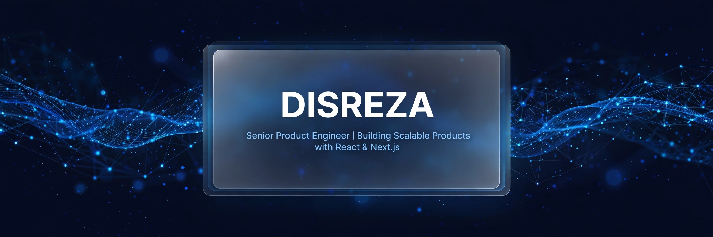
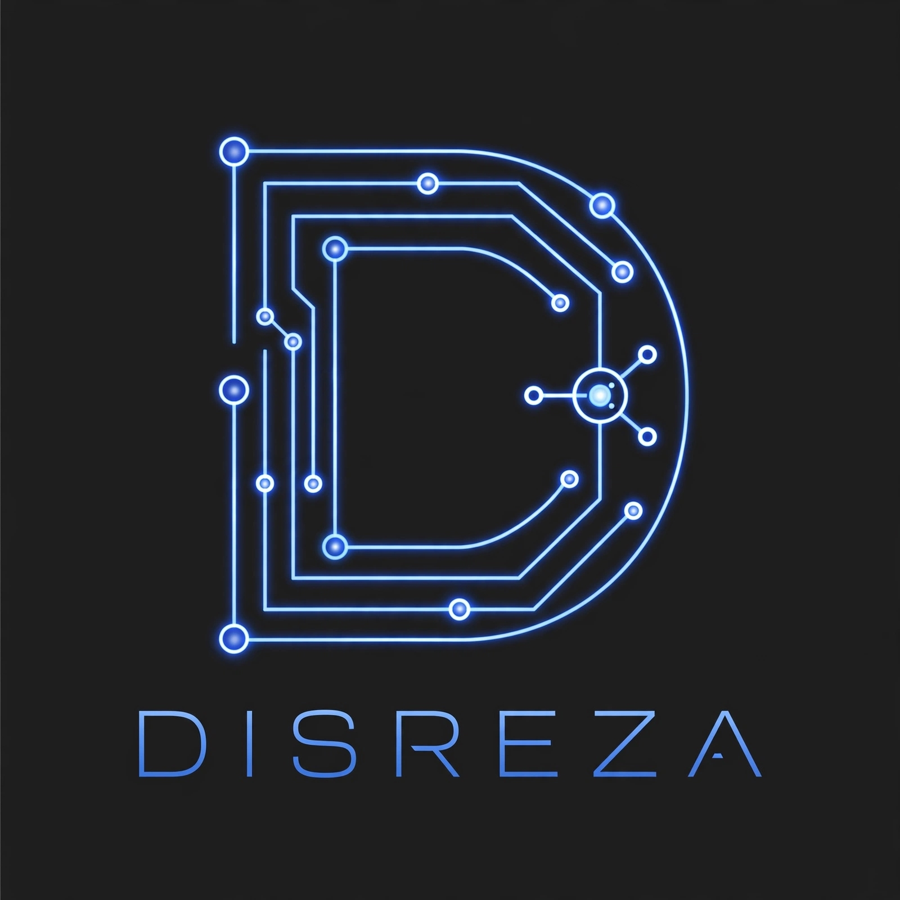

  

  
    
  

 

  
  
  

  

  
  

---

### 🚀 SYSTEMS I SHIP

| | |
|---|---|
| **🏢 CRM Engine** `Lead → Deal → Automation` | **👥 HRM Core** `Hiring → Payroll → Performance` |
| **🏭 Industrial OS** `IoT → AI → Factory Insights` | **⚙️ Custom SaaS** `Your Idea → Scalable Product` |

  

  

